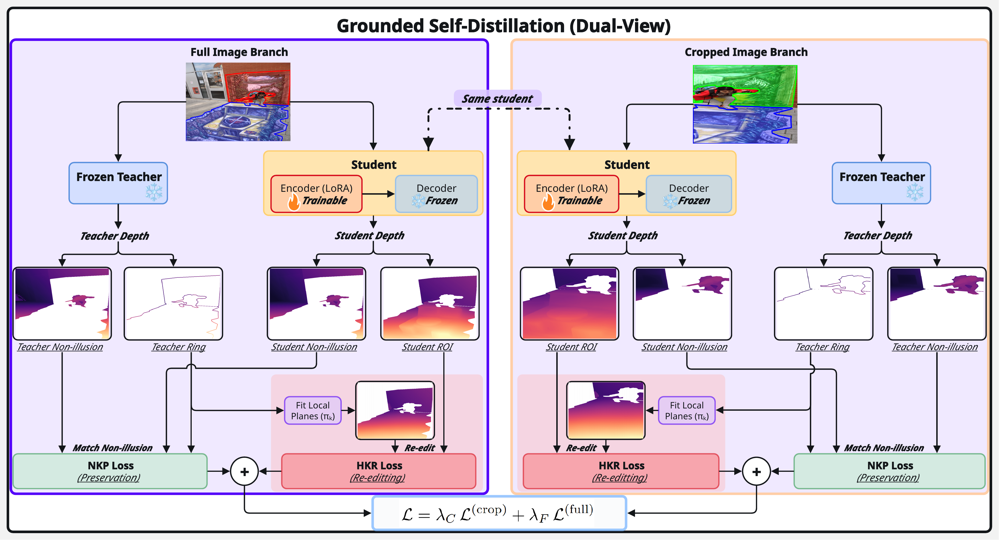

<h1 align="center">The 3D Mirage:<br>Probing and Taming 3D Hallucinations</h1>

<p align="center">
<a href=""></a>
<a href="https://pytorch.org/get-started/locally/"></a>
<a href="https://huggingface.co/hdnndh/3D-Mirage"></a>
</p>

<p align="center">
<a href=""><b>Paper</b></a> · <a href="3dmirage_demo.ipynb"><b>Training / Eval Notebook</b></a>
</p>

<p align="center"><i>
Hoang Nguyen*, Xiaohao Xu*†, Xiaonan Huang<br>
University of Michigan<br>
* Equal Contribution &nbsp; † Project Lead
</i></p>

---

**3D-Mirage** studies a failure mode in monocular depth foundation models: visually flat or low-curvature surfaces with illusion patterns can produce non-existent 3D structure, especially under restricted context. We provide a benchmark, reference-free DCS/CCS metrics, and a parameter-efficient Grounded Self-Distillation (GSD) recipe that adapts Depth-Anything-V2 Large with LoRA while preserving the frozen teacher behavior outside illusion regions.

<p align="center">

</p>

## Released notebook

The main release is a single notebook:

```text
3dmirage_demo.ipynb
```

It contains dataset loading, train/test splitting, LoRA setup, the GSD training objective, DCS/CCS evaluation, and a background-preservation check.

## Main 3D-Mirage results

Lower is better for DCS/CCS.

<div align="center">

| Model | dcluster↓ | davg↓ | DCS↓ | Dcluster↓ | Davg↓ | CCS↓ |
|:---|---:|---:|---:|---:|---:|---:|
| DepthPro | 317.8 | 331.4 | 649.1 | 6.680e-4 | 9.290e-4 | 1.597e-3 |
| Marigold | 701.1 | 726.2 | 1.427e3 | 2.294e-3 | 2.402e-3 | 4.696e-3 |
| ZoeDepth | 291.5 | 297.7 | 589.3 | 7.486e-4 | 7.560e-4 | 1.505e-3 |
| MiDaS | 330.2 | 340.0 | 670.2 | 4.120e-4 | 5.090e-4 | 9.220e-4 |
| DAv2-L baseline | 488.8 | 505.8 | 994.6 | 6.840e-4 | 7.820e-4 | 1.466e-3 |
| **Ours** | **28.55** | **30.08** | **58.64** | **9.174e-5** | **9.894e-5** | **1.907e-4** |
| Δ vs. DAv2-L | -94.16% | -94.05% | -94.10% | -86.59% | -87.35% | -86.99% |

</div>

## 3DVI zero-shot evaluation

We also evaluate on the 3D Visual Illusion (3DVI) test set from Yao et al. using the provided illusion masks and a globally shared affine scale/shift alignment. Lower is better except δ1.

<div align="center">

| Method | FT | EPE↓ | bad2↓ | bad3↓ | bad5↓ | AbsRel↓ | RMSE↓ | δ1↑ |
|:---|:---:|---:|---:|---:|---:|---:|---:|---:|
| DAv2 | × | 5.81 | 61.45 | 43.18 | 30.57 | 0.14 | 0.15 | 92.86 |
| Metric3D | × | 12.46 | 94.11 | 91.14 | 82.05 | 0.34 | 0.29 | 48.97 |
| DepthPro | × | 12.26 | 87.08 | 80.60 | 62.43 | 0.28 | 0.25 | 65.92 |
| DAv2 metric (align) | × | 5.23 | 56.82 | 45.50 | 28.89 | 0.17 | 0.15 | 93.70 |
| Metric3D (align) | × | 5.70 | 66.26 | 50.92 | 40.43 | 0.17 | 0.17 | 94.80 |
| DepthPro (align) | × | 4.36 | 44.98 | 34.98 | 24.70 | 0.09 | 0.10 | 93.83 |
| 3DVI | ✓ | 1.77 | 26.72 | 15.73 | **3.60** | **0.03** | 0.08 | **99.60** |
| **Ours** | × | **1.75** | **26.67** | **15.52** | 6.59 | **0.03** | **0.06** | 99.50 |

</div>

## Setup

```bash
pip install torch torchvision
pip install transformers peft opencv-python-headless shapely huggingface_hub
```

For Colab, open the notebook and run cells in order. The positive 3D-Mirage samples are downloaded from HuggingFace. Optional regularizer negatives can be placed in `neg_data/` before training:

```text
neg_data/
├── PennFudanPed/PNGImages/*.png
└── CamVid/*.png
```

## Quick start

```text
1. Open 3dmirage_demo.ipynb
2. Set paths / batch size in the config cell
3. Run dataset, model, training, and evaluation cells
4. The LoRA adapter is saved to ./3dmirage_lora_best
```

The notebook defaults to `BS = 8` and is intended for an A100. On a smaller GPU, reduce the batch size.


## Acknowledgements

This work builds on [Depth Anything V2](https://github.com/DepthAnything/Depth-Anything-V2) (Yang et al., NeurIPS 2024), [Hugging Face Transformers](https://github.com/huggingface/transformers), and [PEFT](https://github.com/huggingface/peft). We thank the authors of [3D Visual Illusion Depth Estimation](https://arxiv.org/abs/2505.13061) (Yao et al., NeurIPS 2025; [code](https://github.com/YaoChengTang/3D-Visual-Illusion-Depth-Estimation)) for the 3DVI benchmark and evaluation protocol. We also use the [Penn-Fudan Pedestrian dataset](https://www.cis.upenn.edu/~jshi/ped_html/) (Wang et al., 2007) and the [CamVid dataset](http://mi.eng.cam.ac.uk/research/projects/VideoRec/CamVid/) (Brostow et al., 2009) as optional non-illusion regularizer images. LoRA adaptation follows [LoRA: Low-Rank Adaptation of Large Language Models](https://openreview.net/forum?id=nZeVKeeFYf9) (Hu et al., ICLR 2022).

## Citation

```bibtex
@article{nguyen2026threedmirage,
  title={The 3D Mirage: Probing and Taming 3D Hallucinations},
  author={Nguyen, Hoang and Xu, Xiaohao and Huang, Xiaonan},
  journal={arXiv preprint arXiv:},
  year={2026}
}
```
